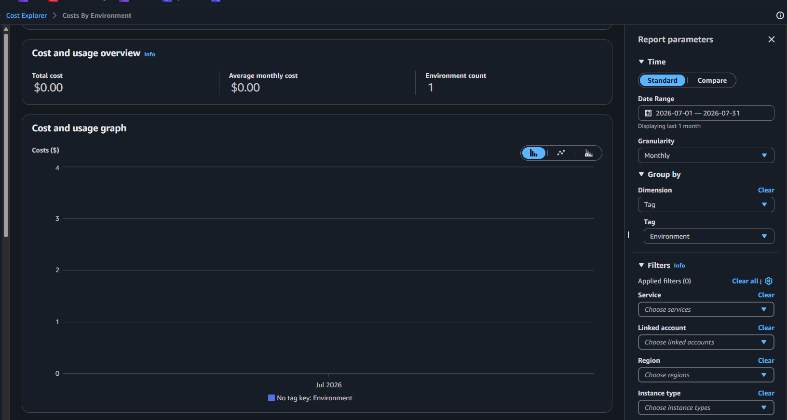
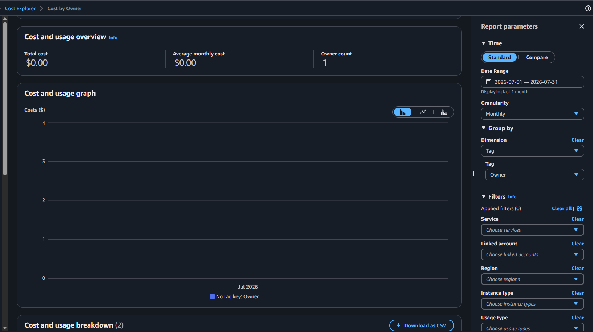
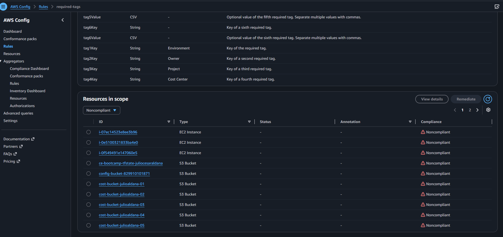

# Tag Compliance Report
 
## Summary
- **Total Resources:** 12
- **Tagged Resources:** 12
- **Compliance Rate:** 0%
 
## Non-Compliant Resources

- i-07ec14523e8ee3b96 - EC2 Instance
- i-0e5100321833ba4e0 - EC2 Instance 
- i-0f549491e147060e5 - EC2 Instance
- ce-bootcamp-tfstate-juliocesaraldana - S3 Bucket
- config-bucket-829910101871 - S3 Bucket
- cost-bucket-julioaldana-01 - S3 Bucket 
- cost-bucket-julioaldana-02 - S3 Bucket
- cost-bucket-julioaldana-03 - S3 Bucket
- cost-bucket-julioaldana-04 - S3 Bucket
- cost-bucket-julioaldana-05 - S3 Bucket
- cost-bucket-julioaldana-06 - S3 Bucket
- cost-bucket-julioaldana-07 - S3 Bucket
 
## Remediation Plan
1. Tag remaining resources by 08/19/2026
2. Enable tag policies in AWS Organizations
3. Implement IaC tagging defaults
 
## Screenshots

